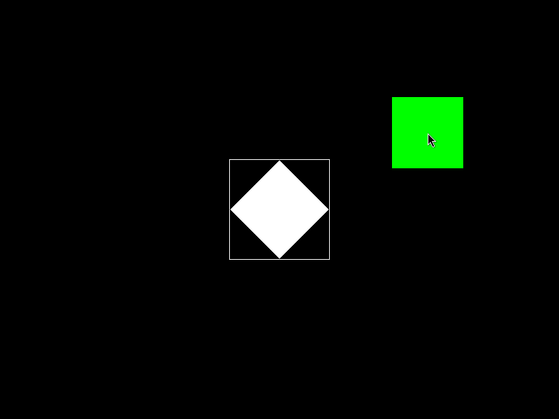
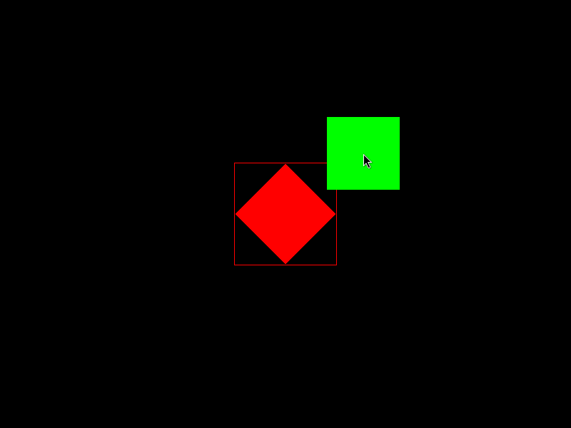
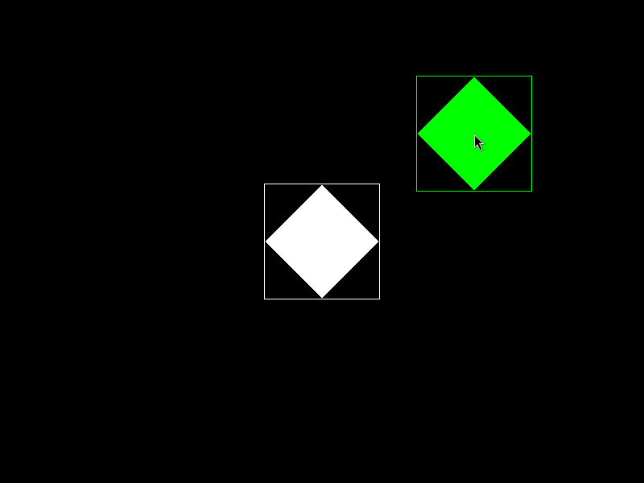
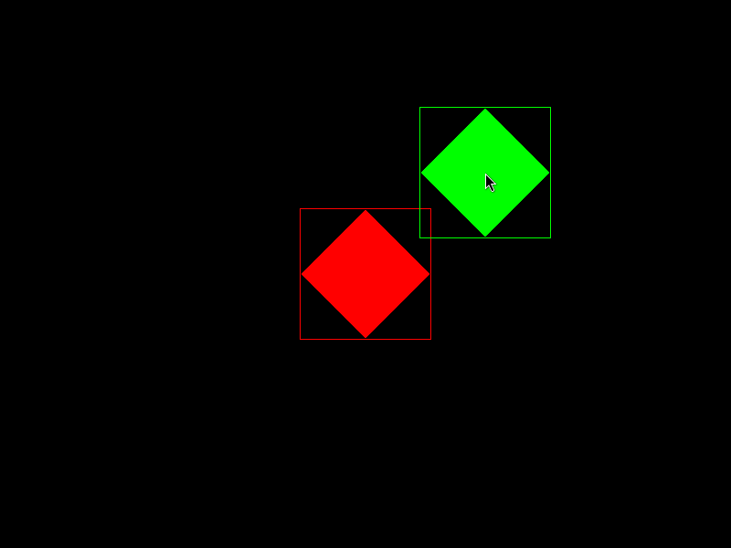

# Ejemplo con Colisiones

En este ejemplo básico con `SFML` se intenta analizar la utilización de colisiones utilizando `getGlobalBounds()` en conjunto con `intersects()` para ver sus fortalezas y debilidades, comprender las limitaciones y cuándo es de utilidad para detectar colisiones en los juegos.

En este ejemplo hay dos cuadrados, uno fijo en el medio de la pantalla, rotado 45° y de color blanco, junto al contorno (bounds) dibujado mostrando el *área de colisión*. Otro cuadrado de igual tamaño, pero de color verde y móvil a través de la posición del mouse, se dibuja y al aproximarlo al área de colisión, hace que el fijo cambie a color rojo al detectar la misma.

Al mantener presionado el clic izquierdo el cuadrodo verde rota 45° dejando en evidencia el área de colisión del mismo, y empeorando la detección de colisiones entre las figuras:

